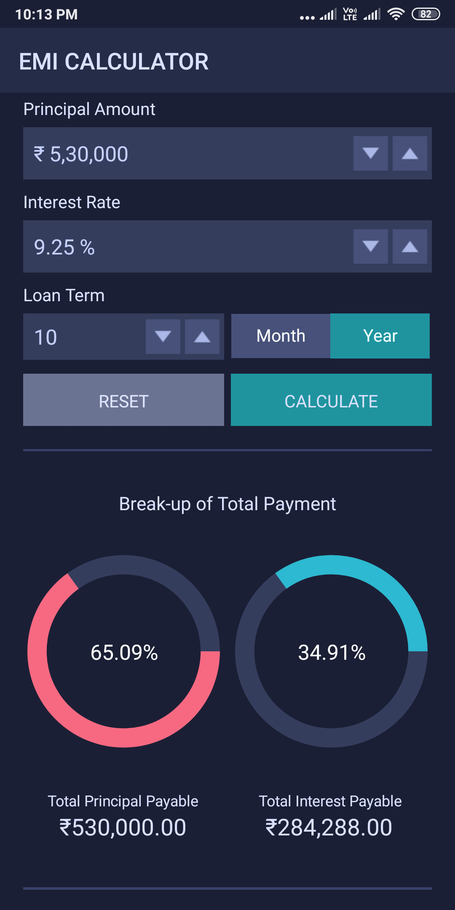
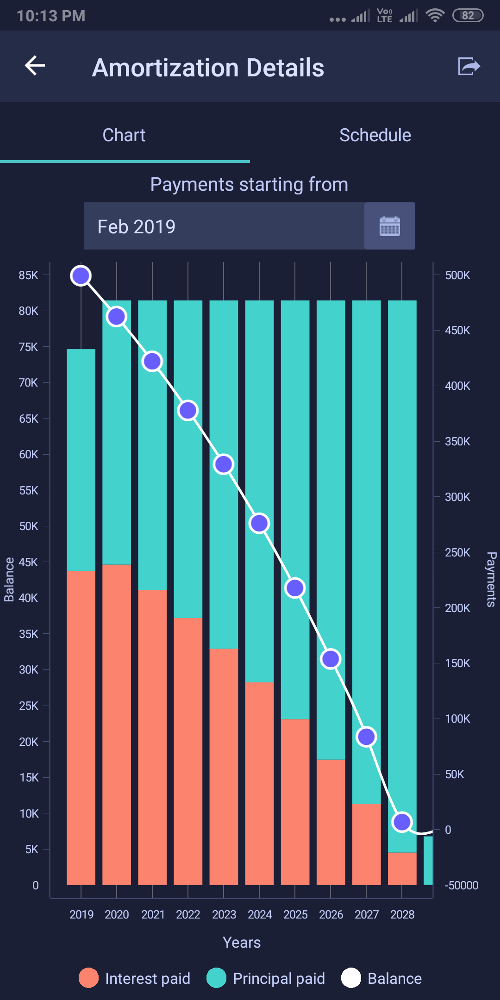
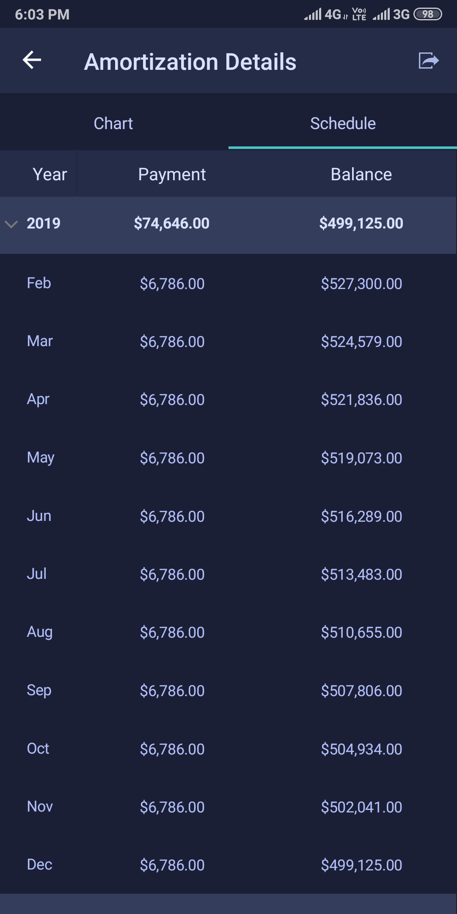
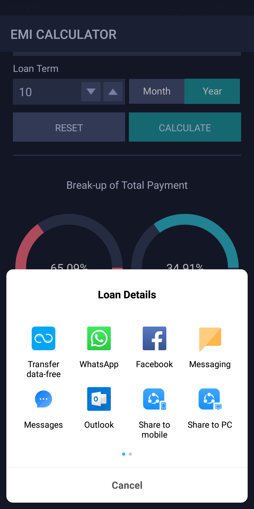
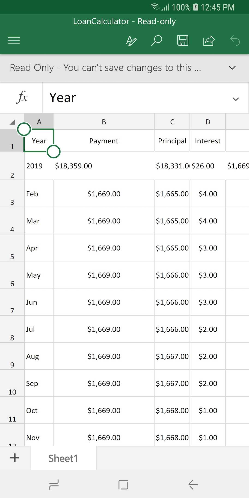
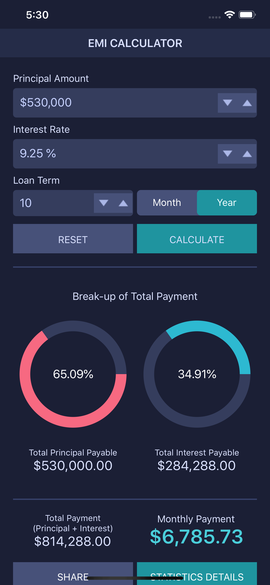
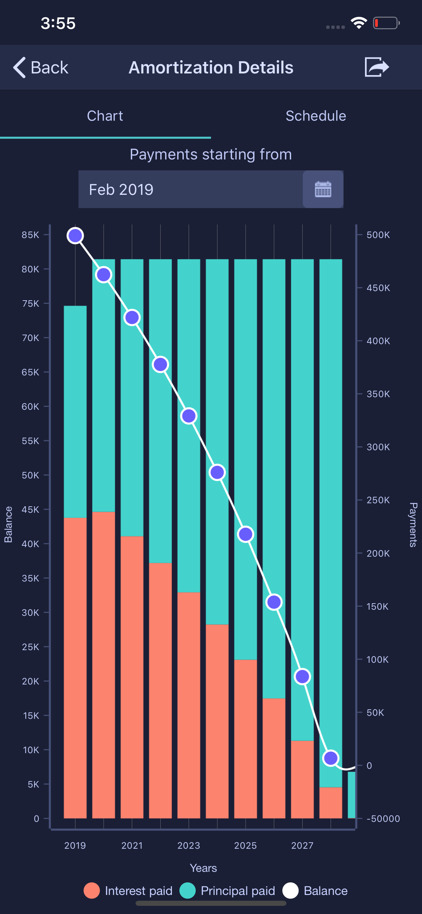
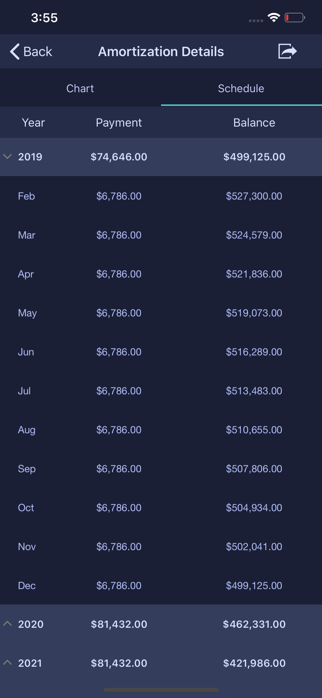
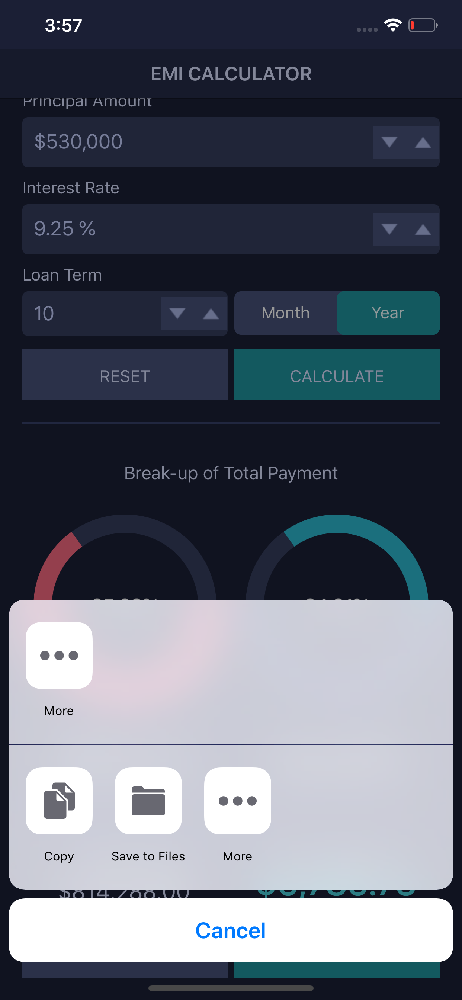
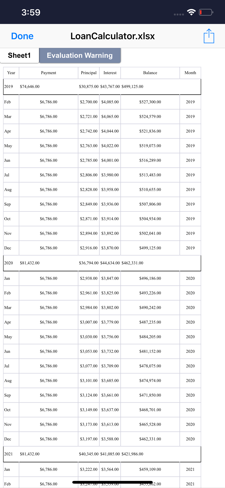

# EMI Calculator

The EMI (Equated Monthly Instalment) Calculator is an application developed using Xamarin.Forms and Syncfusion controls to calculate the EMI with the given details of principal amount, tenure, and interest. This project uses the following patterns and features:

* XAML UI
* Converters
* Custom controls
* Data binding
* Behaviours
* MVVM
* Xamarin.Essentials 
* Localization
* Styles
* AutoFac for dependency injection
* Phone, tablet and desktop layout

## Syncfusion Controls

This project uses the following Syncfusion controls:

* SfNumericUpDown
* SfChart
* SfDataGrid
* SfTabView
* XlsIO
* SfButton

## Key features

### EMI Calculation

* Calculates the EMI for loans.
* Shares the summary of the calculated EMI details through different applications installed in a phone.
* Visualizes the amortization details in charts and grids.
* Exports detailed amortization in an Excel sheet and shares it.

## Screens

**Android**

   

**iOS**

   

## Supported platforms: ##

| Platforms | Supported versions |
| --------- | ------------------ |
| Android   | API level 19 and later versions |
| iOS | iOS 9.0 and later versions |
| UWP | Windows 10 devices |

Please refer to the link for more information:

<https://help.syncfusion.com/xamarin/installation-and-upgrade/system-requirements>

## Third party assemblies

This application uses following third party assemblies. 

* Xamarin.Essentials
* AutoFac

## Requirements to run the demo ##

* [Visual Studio 2017](https://visualstudio.microsoft.com/downloads/) or [Visual Studio for Mac](https://visualstudio.microsoft.com/vs/mac/).
* Xamarin add-ons for Visual Studio (available via the Visual Studio installer).

## How to run the sample ##
  
1. Clone the sample and open it in Visual Studio.

   *Note: If you download the sample using the "Download ZIP" option, right-click it, select Properties, and then select Unblock.*

2. Register your license key in App.cs as shown below.

        public App()
        {
            //Register Syncfusion license
            Syncfusion.Licensing.SyncfusionLicenseProvider.RegisterLicense("YOUR LICENSE KEY");

            InitializeComponent();

            MainPage = new MasterDetail();
        } 

   Refer this [link](https://help.syncfusion.com/common/essential-studio/licensing/license-key#xamarinforms) for more information.

3. Set any one of the platform specific projects (iOS, Android, UWP) as a startup project.
4. Clean and build the application.
5. Run the application.

## License ##

Syncfusion has no liability for any damage or consequence that may arise by the use or viewing of the samples. The samples are for demonstrative purposes and if you choose to use or access the samples you agree to not hold Syncfusion liable, in any form, for any damage that is related to use, accessing or otherwise viewing the samples. By accessing, viewing, or otherwise seeing the samples you acknowledge and agree Syncfusion’s samples will not allow you to seek injunctive relief in any form for any claim related to the sample. If you do not agree to this, do not view, access, utilize or otherwise do anything with Syncfusion’s samples.
